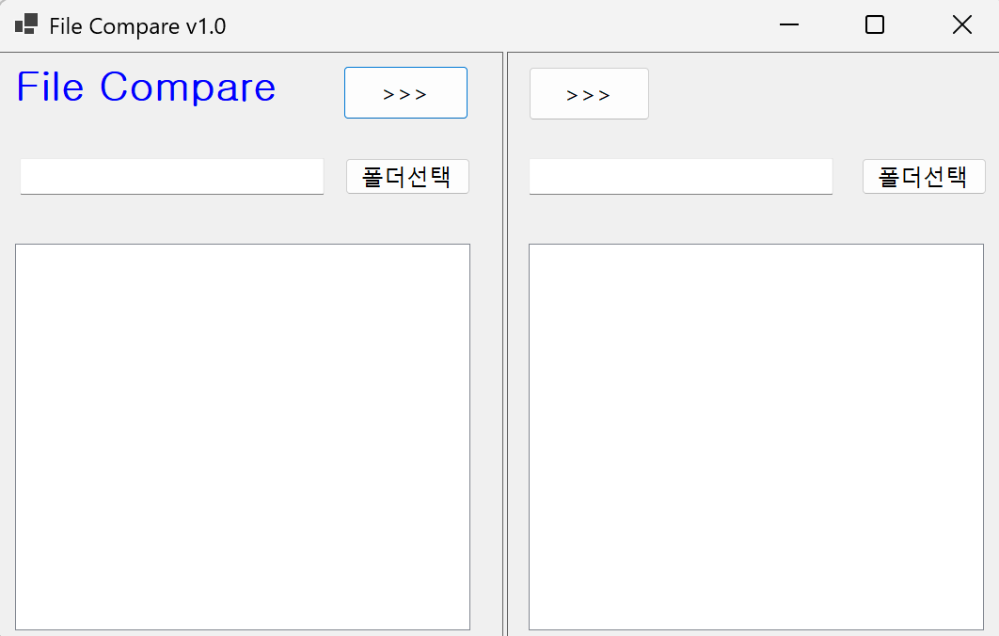
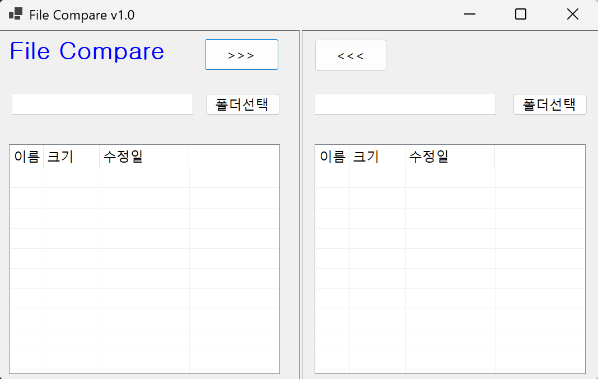
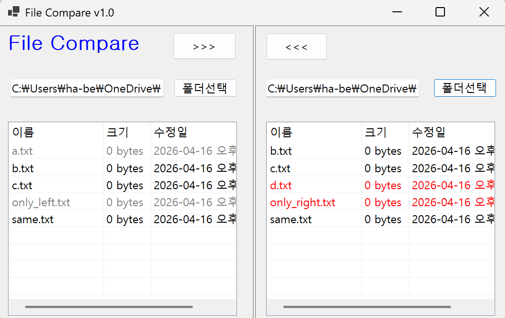
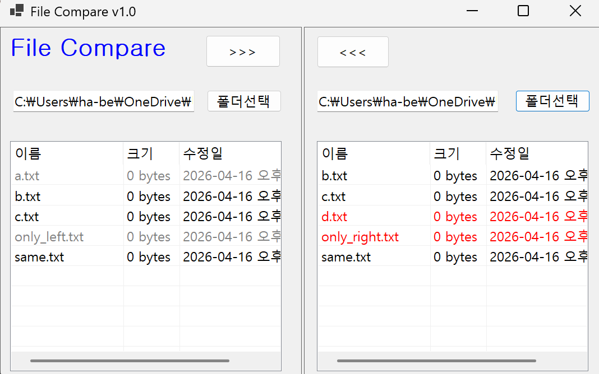

# (C# 코딩) 7주차 과제: File Compare
-이름: 하다현 (24018097)

## 개요
- C# 프로그래밍 학습
- 1줄 소개: 두 개의 폴더를 선택하여 파일 목록을 비교하고 관리할 수 있는 Windows Forms 기반 프로그램
- 사용한 플랫폼: C#, .NET Windows Forms, Visual Studio, GitHub, Visual Code
- 사용한 컨트롤: SplitContainer, Panel, Button, Label, ListView, textBox
- 사용한 기술과 구현한 기능:
  - Visual Studio를 이용하여 UI 디자인
  - FolderBrowserDialog를 이용한 폴더 선택 기능 구현
  - Directory 및 FileInfo 클래스를 활용한 파일 정보(이름, 크기, 수정 날짜) 추출
  - ListView를 이용한 파일 목록 출력 및 SubItem을 통한 상세 정보 표시
  - Dictionary 자료구조를 활용하여 양쪽 폴더의 파일 정보를 저장하고 비교 기능 구현
  - OwnerDraw 기능을 사용하여 파일 상태에 따른 색상 표시 (동일 파일, 단독 파일, 변경된 파일 구분)
  - 파일 비교 기능: 파일 존재 여부 및 크기 비교를 통해 동일/변경 파일 판별
  - File.Copy()를 이용한 파일 복사 기능 구현
  - MessageBox를 활용한 사용자 확인 기능 (덮어쓰기 여부 결정)
  - File.GetLastWriteTime()을 이용한 수정 날짜 비교로 최신 파일 보호

---

## 실행 화면 (과제1)
- 코드의 실행 스크린샷과 구현 내용 설명

- 구현한 내용( 위 그림 참조 )
  - 컨트롤을 위치에 맞게 배치하였다.
  - 화면을 좌측과 우측으로 나누기 위해 SplitContainer 사용하였고, Dock 속성을 Fill로 설정하여 form 크기에 맞게 자동으로 확장되도록 하였다.
  - 좌측과 우측 영역에 각각 3개씩 Panel을 배치하였다.
  - SplitContainer을 움직여도 버튼, 텍스트박스, 리스트뷰가 유지되도록 Anchor 속성을 설정해 고정시켰다.
  - ListView는 영역 전체를 채우도록 Dock을 Fill로 설정하여 가독성을 높였다.

    cf) Label("File Compare") -> lblAppName
	Button-">>>(왼쪽)" -> btnLeftDir
		 -">>>(오른쪽)" -> btnRightDir
		 -"폴더선택(왼)" -> btnCopyFromLeft
		 -"폴더선택(오)" -> btnCopyFromRight
	textBox - 왼 -> txtLeftDir
	textBox - 오 -> txtRightDir
	ListView - 왼 -> lvwLeftDir
	         - 오 -> lvwRightDir

 ---

## 실행 화면 (과제2)
- 코드의 실행 스크린샷과 구현 내용 설명

- 구현한 내용 (위 그림 참조)
  - FolderBrowserDialog를 사용하여 왼쪽 폴더와 오른쪽 폴더를 각각 선택할 수 있도록 구현하였다.
  - “폴더 선택(왼쪽)” 버튼과 “폴더 선택(오른쪽)” 버튼을 통해 사용자가 원하는 폴더를 지정할 수 있도록 하였다.
  - 선택된 폴더 경로는 각각 TextBox(txtLeftDir, txtRightDir)에 표시되도록 구성하였다.
  - 선택된 폴더 내부의 파일 목록은 ListView(lvwLeftDir, lvwRightDir)에 출력되도록 구현하였다.
  - Directory.EnumerateFiles()를 사용하여 폴더 내 파일 목록을 가져오고 FileInfo 클래스를 통해 파일 이름, 크기, 수정 시간을 구하였다.
  - ListViewItem과 SubItem을 사용하여 파일 정보를 한 줄 단위로 구성하여 표시하였다.
  - PopulateListView() 함수를 통해 왼쪽과 오른쪽 ListView에 동일한 방식으로 파일 목록을 출력하도록 구현하였다.
  - Dictionary<string, FileInfo>를 사용하여 각 폴더의 파일 정보를 저장하여 이후 파일 비교 및 색상 구분 기능 구현에 활용할 수 있도록 하였다.
  - 이를 통해 두 폴더의 파일 구조를 비교할 수 있는 기반을 구성하였다.
  

    cf) try~catch문: 프로그램 실행 중에 예상치 못한 오류(예외)가 발생했을 때, 프로그램이갑자기 꺼지지 않도록 방어막을 치는 장치
---

## 실행 화면 (과제3)
- 코드의 실행 스크린샷과 구현 내용 설명

- 구현한 내용 (위 그림 참조)
  - 왼쪽과 오른쪽 ListView에서 선택한 파일을 반대쪽 폴더로 복사하는 기능을 구현하였다.
  - 복사 대상 파일이 이미 존재하는 경우 File.Exists()를 통해 존재 여부를 확인하였다.
  - 기존 파일이 존재하면 MessageBox를 이용하여 사용자에게 덮어쓰기 여부를 확인하도록 구현하였다.
  - 파일의 최신 상태를 판단하기 위해 File.GetLastWriteTime()을 사용하여 수정 날짜를 비교하였다.
  - 원본 파일이 더 오래된 경우 복사를 중단하여 데이터 손실을 방지하도록 구현하였다.
  - 복사 후 PopulateListView()를 다시 호출하여 ListView가 즉시 갱신되도록 하였다.

---

## 실행 화면 (과제4)
- 코드의 실행 스크린샷과 구현 내용 설명

- 구현한 내용 (위 그림 참조)
  - 상위 폴더뿐만 아니라 하위 폴더까지 포함하여 파일을 비교할 수 있도록 기능을 확장하였다.
  - Directory.GetFiles() 대신 하위 폴더까지 탐색할 수 있도록 재귀 탐색(Recursive Search) 구조를 적용하였다.
  - 파일뿐만 아니라 폴더 구조까지 하나의 단위로 처리하여 전체 디렉토리 구조를 비교할 수 있도록 구현하였다.
  - 하위 폴더에 포함된 파일들도 동일하게 Dictionary 구조에 저장하여 비교 대상에 포함하였다.
  - 이를 통해 단순 파일 비교가 아닌 전체 폴더 트리 비교 기능을 구현하였다.
  - 복사 기능 또한 하위 폴더를 포함하여 전체 구조를 복사하도록 개선하였다.
  - Directory.CreateDirectory()를 사용하여 대상 폴더 구조를 먼저 생성한 후 File.Copy()를 통해 모든 파일을 복사하였다.
  - 복사 시 하위 폴더 구조가 유지되도록 경로를 그대로 반영하여 데이터 손실 없이 전체 복사가 가능하도록 구현하였다
